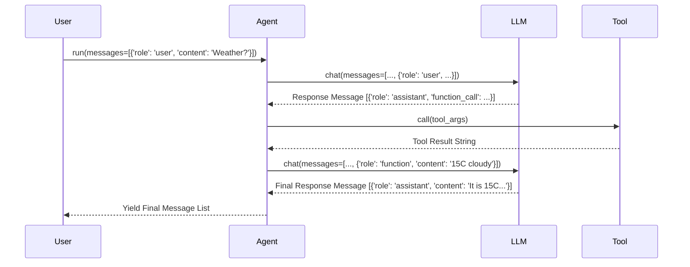

# Chapter 4: Message (Communication Structure)

In the previous chapters, we met the [Agent (Base Class)](01_agent__base_class__.md), the agent's "brain" or [BaseChatModel (LLM Interface)](02_basechatmodel__llm_interface__.md), and the agent's "hands" or [BaseTool (Tool Interface)](03_basetool__tool_interface__.md). We saw how they can work together, like when the agent used the `web_search` tool.

But how do all these parts *talk* to each other? How does the user send a request? How does the agent tell the LLM what to do? How does the LLM ask to use a tool? How does the tool report its result? They need a common language, a standard format for passing information back and forth. This standard format is the `Message`.

## What's a Message? The Envelope of Communication

Imagine you're sending letters or emails. You don't just write your text on a blank piece of paper and hope it gets there. You put it in an envelope with specific information: who it's *from*, who it's *to* (implicitly), and the actual *content*.

In Qwen Agent, the `Message` is like that structured envelope or a chat bubble in a messaging app. It's the standard way **all** information is packaged and exchanged within the system. Whether it's your initial request, the agent's internal thoughts (sometimes), the LLM's response, or the result from a tool, everything is wrapped up neatly inside a `Message`.

This ensures that every component knows how to interpret the information it receives.

## The Structure of a `Message`

Every `Message` typically has two main parts, just like a chat bubble:

1.  **`role`**: Who is speaking? This tells the system the *purpose* or *origin* of the message. Common roles include:
    *   `system`: Initial instructions or context given to the agent/LLM, like setting its personality ("You are a helpful assistant.").
    *   `user`: You, the person interacting with the agent. This is your input or request.
    *   `assistant`: The AI agent or the LLM speaking back to you or requesting an action (like using a tool).
    *   `function` (or `tool`): The result returned by a [Tool](03_basetool__tool_interface__.md) after it was used.

2.  **`content`**: What is being said? This is the actual substance of the message.
    *   It's often simple **text**.
    *   But it can also be **multimodal**, meaning it can contain other things like references to images, audio files, or documents you've uploaded. (We'll keep it simple for now, mostly focusing on text).

Besides these core parts, a `Message` might sometimes include:

*   **`name`**: The specific name of the sender, especially useful when a `function`/`tool` role is used (to know *which* tool provided the result) or in scenarios with multiple agents talking to each other ([MultiAgentHub (Agent Coordination)](08_multiagenthub__agent_coordination__.md)).
*   **`function_call`**: A special field used when the `assistant` (the LLM) wants to use a [Tool](03_basetool__tool_interface__.md). It specifies the `name` of the tool to call and the `arguments` (inputs) to give it. We'll explore this more in the next chapter on [BaseFnCallModel (LLM Function Calling)](05_basefncallmodel__llm_function_calling__.md).

## How Messages are Used: A Conversation History

Interactions with an agent aren't usually single messages. They form a conversation, a sequence of messages back and forth. The agent (and the underlying LLM) needs this history to understand the context.

Messages are usually handled as Python dictionaries or special `Message` objects (which behave like dictionaries). Let's see some examples:

**1. A User's Request:**

```python
user_message = {
    'role': 'user',
    'content': 'What is the weather in London?'
}
print(user_message)
```

**Output:**

```
{'role': 'user', 'content': 'What is the weather in London?'}
```

*Explanation:* This is a simple message representing the user asking a question.

**2. An Assistant's Text Response:**

```python
assistant_response = {
    'role': 'assistant',
    'content': 'I can check that for you. One moment.'
}
print(assistant_response)
```

**Output:**

```
{'role': 'assistant', 'content': 'I can check that for you. One moment.'}
```

*Explanation:* This is the agent (or LLM) replying with text.

**3. An Assistant Requesting a Tool Call:**

```python
assistant_tool_request = {
    'role': 'assistant',
    'content': None, # Often no text content when requesting a tool
    'function_call': {
        'name': 'get_weather',
        'arguments': '{"location": "London"}' # Arguments often as a JSON string
    }
}
print(assistant_tool_request)
```

**Output:**

```
{'role': 'assistant', 'content': None, 'function_call': {'name': 'get_weather', 'arguments': '{"location": "London"}'}}
```

*Explanation:* Here, the assistant isn't just talking. It's asking the agent framework to run the `get_weather` tool with the location "London". Notice the `function_call` field.

**4. A Tool's Result:**

```python
tool_result_message = {
    'role': 'function',
    'name': 'get_weather', # Specifies which tool ran
    'content': 'The weather in London is 15°C and cloudy.'
}
print(tool_result_message)
```

**Output:**

```
{'role': 'function', 'name': 'get_weather', 'content': 'The weather in London is 15°C and cloudy.'}
```

*Explanation:* This message represents the outcome of running the `get_weather` tool. The `role` is `function`, and the `name` matches the tool called.

**Putting it Together: The Conversation List**

When you interact with an agent using the `agent.run()` method, you usually pass a *list* of these message dictionaries, representing the conversation history so far. The agent adds its own responses (and tool interactions) to this list.

```python
conversation_history = [
    {'role': 'user', 'content': 'What is the weather in London?'},
    {'role': 'assistant', 'function_call': {'name': 'get_weather', 'arguments': '{"location": "London"}'}},
    {'role': 'function', 'name': 'get_weather', 'content': 'The weather in London is 15°C and cloudy.'},
    # The LLM will likely generate a final assistant message based on the tool result next...
]

# The agent would process this list and add the next message(s)
# For example:
# final_assistant_reply = {'role': 'assistant', 'content': 'Currently, it is 15°C and cloudy in London.'}
# conversation_history.append(final_assistant_reply)

print(conversation_history) # Shows the state before the final reply
```

**Output:**

```
[{'role': 'user', 'content': 'What is the weather in London?'}, {'role': 'assistant', 'function_call': {'name': 'get_weather', 'arguments': '{"location": "London"}'}}, {'role': 'function', 'name': 'get_weather', 'content': 'The weather in London is 15°C and cloudy.'}]
```

*Explanation:* This list shows the flow: user asks, assistant decides to use a tool, the tool result comes back. This whole list is fed back to the LLM so it can generate the final natural language response based on the tool's findings.

## Under the Hood: Messages Everywhere!

The key takeaway is that **every single step** of communication within the Qwen Agent framework uses this `Message` structure.

1.  **You** provide the initial `user` message(s).
2.  The **Agent** might add a `system` message.
3.  The **Agent** sends the message list to the **[LLM](02_basechatmodel__llm_interface__.md)**.
4.  The **LLM** sends back an `assistant` message (either text or a `function_call`).
5.  If it's a `function_call`, the **Agent** extracts the details.
6.  The **Agent** calls the specific **[Tool](03_basetool__tool_interface__.md)**.
7.  The **Tool** executes and returns its result.
8.  The **Agent** wraps this result in a `function` message.
9.  The **Agent** sends the updated message list (including the `function` message) back to the **LLM**.
10. The **LLM** generates the final `assistant` text response based on the tool's result.
11. The **Agent** streams this final `assistant` message back to **You**.

Every arrow in this process represents information packaged as one or more `Messages`.


*(Note: Each interaction involves passing lists of messages, often containing the history)*

## Diving into the Code (Simplified)

Where is this structure actually defined? It lives in the `llm/schema.py` file and uses Pydantic, a library for data validation and settings management using Python type annotations.

**`llm/schema.py` (Simplified `Message` structure):**

```python
# File: llm/schema.py (Simplified)
from pydantic import BaseModel
from typing import List, Literal, Optional, Union

# Define constants for roles
USER = 'user'
ASSISTANT = 'assistant'
SYSTEM = 'system'
FUNCTION = 'function'

class FunctionCall(BaseModel): # Structure for tool calls
    name: str
    arguments: str

class ContentItem(BaseModel): # Structure for multimodal content
    text: Optional[str] = None
    image: Optional[str] = None # Path or URL to image
    file: Optional[str] = None  # Path or URL to file
    # ... audio, video etc. ...

    # (Validation logic ensures only one field is set)

class Message(BaseModel): # The main Message structure
    role: str # Must be one of USER, ASSISTANT, SYSTEM, FUNCTION
    content: Union[str, List[ContentItem]] # Text or list of multimodal items
    name: Optional[str] = None # Optional: Tool name for function role
    function_call: Optional[FunctionCall] = None # Optional: For assistant requesting tool

    # (Validation logic ensures fields are consistent with the role)

    # Make it behave somewhat like a dictionary
    def __getitem__(self, item):
        return getattr(self, item)
```

**Explanation:**

*   **Constants:** Defines standard strings for roles (`USER`, `ASSISTANT`, etc.).
*   **`FunctionCall`:** A simple Pydantic model to hold the `name` and `arguments` for a requested tool call.
*   **`ContentItem`:** Defines how different types of content (text, image, file) can be represented. The `Message` `content` field can hold a list of these items for multimodal input/output. For simple text, `content` is just a string.
*   **`Message`:** The core class. It uses type hints (`role: str`, `content: Union[...]`, etc.) to define the expected structure. Pydantic uses these hints to automatically validate messages when they are created or processed.
*   **`Optional` / `Union`:** These indicate fields that might not always be present (`name`, `function_call`) or fields that can hold different types (`content` can be a string *or* a list of `ContentItem`s).
*   **Dictionary-like Behavior:** Although these are classes, they are designed to be easily created from and converted to Python dictionaries, which is how you often interact with them in agent code.

You generally don't need to interact with these Pydantic classes directly unless you are developing custom components. When using the agent's `run` method, you'll typically provide and receive standard Python dictionaries that follow this structure. The framework handles the conversion to and from these Pydantic models internally for validation and consistency.

## Conclusion

You've learned about the `Message` structure, the fundamental building block for communication in Qwen Agent!

*   It's the **standard format** for all information exchange (like an email or chat bubble).
*   Key components are `role` (who's speaking) and `content` (what's being said).
*   It can include optional fields like `name` (for tools/multi-agent) and `function_call` (for requesting tool use).
*   All interactions – user input, LLM responses, tool results – are packaged as `Messages`.
*   A **list of Messages** forms the conversation history, providing context.

Now that we understand *how* information is packaged, let's dive deeper into a crucial capability: how the `assistant` (LLM) uses a special `Message` with a `function_call` to ask the agent to use a [Tool](03_basetool__tool_interface__.md).

**Next Chapter:** [BaseFnCallModel (LLM Function Calling)](05_basefncallmodel__llm_function_calling__.md)

---

Generated by [AI Codebase Knowledge Builder](https://github.com/The-Pocket/Tutorial-Codebase-Knowledge)