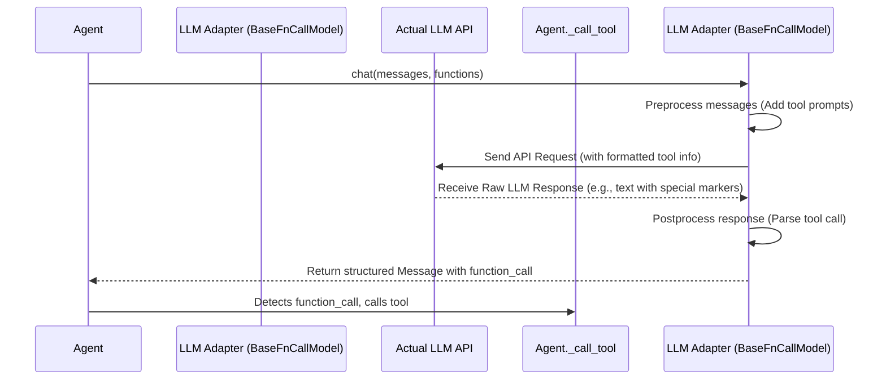

# Chapter 5: BaseFnCallModel (LLM Function Calling)

In [Chapter 4: Message (Communication Structure)](04_message__communication_structure__.md), we learned how components in Qwen Agent communicate using the standard `Message` format. We even saw a special kind of `Message` where the `assistant` role included a `function_call` field, instructing the agent to use a [Tool](03_basetool__tool_interface__.md).

But how does the [LLM](02_basechatmodel__llm_interface__.md), which usually just generates text, produce this specific `function_call` instruction? And how does the agent framework ensure this instruction is generated and understood correctly, even though different LLMs might have *completely different ways* of signalling a tool call?

This is where `BaseFnCallModel` comes in. It's a specialized adapter that handles the tricky business of talking to LLMs about using tools.

## Why Do We Need a Special Adapter for Function Calls?

Imagine you're talking to two different assistants, Alice and Bob.

*   To ask Alice to fetch the weather, you might need to say, "Alice, please use the weather tool for London."
*   To ask Bob, you might need to write a special note like: `{ "tool": "weather", "location": "London" }`.

Different LLMs are like Alice and Bob. Some understand tool calls naturally, while others need very specific formatting in their prompts or produce unique text patterns in their output to indicate a tool call.

A standard [BaseChatModel](02_basechatmodel__llm_interface__.md) knows how to have a basic chat. But if we want our agent to reliably use tools with different LLMs, we need something more specialized.

**`BaseFnCallModel` acts as this specialist.** It extends `BaseChatModel` to handle the specific "language" required for function/tool calling with different LLMs. It translates the agent's generic request ("Here are the available tools, please answer the user's query") into the exact format the LLM expects and translates the LLM's specific response (which might be plain text or a structured format) back into a standard Qwen Agent `Message` with a `function_call` field.

## Key Concepts

1.  **Adapter Pattern:** `BaseFnCallModel` is an adapter. It sits between the general agent logic and the specific LLM, making them compatible for function calling.
2.  **Preprocessing (Talking *to* the LLM):** Before sending messages to the LLM, `BaseFnCallModel` uses special prompt templates (found in `fncall_prompts`). These templates format the list of available [Tools](03_basetool__tool_interface__.md) and the conversation history in the *exact way* the specific LLM (like Qwen or an OpenAI model) needs to see them to understand it can use tools.
3.  **Postprocessing (Understanding *from* the LLM):** After the LLM responds, its output might just be text containing a special marker (like "✿FUNCTION✿: get_weather\n✿ARGS✿: {\"location\": \"London\"}") or a specific JSON structure. `BaseFnCallModel` takes this raw output and parses it, converting it back into a clean, structured `Message` object with the `role` set to `assistant` and the `function_call` field properly filled.

This isolates the complex, model-specific prompt engineering needed for function calls away from the main agent logic, keeping the agent code cleaner and more adaptable to different LLMs.

## How Is It Used? Mostly Automatically!

You typically don't need to create a `BaseFnCallModel` directly. When you use `get_chat_model` (from [Chapter 2](02_basechatmodel__llm_interface__.md)) to set up an LLM that supports function calling, the object you get back often *already uses* `BaseFnCallModel` under the hood.

For example, `QwenChatAtDS` (for Qwen models via DashScope) and `TextChatAtOAI` (for OpenAI-compatible models) both inherit from `BaseFnCallModel`.

```python
# From Chapter 2...
from qwen_agent.llm import get_chat_model

# 1. Get an LLM that supports function calling
llm_config = {'model': 'qwen-plus'} # or 'gpt-4o-mini', etc.
llm = get_chat_model(llm_config)

# 2. Check its inheritance (optional, for learning)
#    BaseFnCallModel itself inherits from BaseChatModel
from qwen_agent.llm import BaseFnCallModel
print(f"Is '{llm_config['model']}' a BaseFnCallModel? ", isinstance(llm, BaseFnCallModel))

# 3. Prepare messages and tool descriptions (functions)
messages = [{'role': 'user', 'content': 'What is the weather in Paris?'}]
tools = [{ # Tool description in OpenAPI Function format
    'name': 'get_weather',
    'description': 'Get the current weather for a location',
    'parameters': {'type': 'object', 'properties': {'location': {'type': 'string'}}}
}]

# 4. Call the LLM's chat method with functions
#    (The Agent usually does this, but we can do it directly)
#    stream=False for a single response here
response = llm.chat(messages=messages, functions=tools, stream=False)

# 5. Print the response
print(response)
```

**Expected Output (structure may vary slightly):**

```
Is 'qwen-plus' a BaseFnCallModel? True
[Message(role='assistant', content=None, name=None, function_call=FunctionCall(name='get_weather', arguments='{"location": "Paris"}'), extra={...})]
```

**Explanation:**

1.  We get an LLM known to support function calls.
2.  We confirm that the returned `llm` object is indeed an instance of `BaseFnCallModel` (or a class inheriting from it).
3.  We define our user message and the *description* of the `get_weather` tool.
4.  We call `llm.chat`, but this time we include the `functions=tools` argument. This signals to the `BaseFnCallModel` logic inside `llm` that tools are available.
5.  Instead of just getting text back, the `BaseFnCallModel`'s postprocessing recognized the LLM wanted to call the tool and returned a `Message` with the `function_call` field populated!

The `BaseFnCallModel` handled adding the tool description to the prompt for the LLM and parsing the LLM's special output back into this structured format. An agent like `FnCallAgent` would then see this `function_call` and proceed to execute the actual [Tool](03_basetool__tool_interface__.md).

## Under the Hood: The Function Calling Flow

Let's trace the steps when an agent uses an LLM via `BaseFnCallModel` to decide on a tool call:

1.  **Agent Request:** The agent (e.g., `FnCallAgent`) calls `llm.chat(messages=..., functions=...)`.
2.  **`BaseFnCallModel` Preprocessing:**
    *   It takes the `messages` and the list of `functions` (tool descriptions).
    *   It uses a specific prompt template (e.g., from `QwenFnCallPrompt` or `NousFnCallPrompt` based on the LLM type) to weave the tool descriptions into the system prompt. This tells the LLM *how* to indicate a function call (e.g., "Use `✿FUNCTION✿:` followed by the name...").
    *   It might also reformat previous `function_call` and `function` messages in the history into plain text that the LLM was trained on.
3.  **LLM Interaction:** The preprocessed messages are sent to the actual LLM API.
4.  **LLM Response:** The LLM generates its response. If it decides to use a tool, its response will contain the special text or structure defined by the prompt template used in step 2.
5.  **`BaseFnCallModel` Postprocessing:**
    *   It receives the raw LLM response text.
    *   It looks for the special patterns (like `✿FUNCTION✿:` or `<tool_call>...</tool_call>`) indicating a tool call.
    *   It extracts the tool name and arguments.
    *   It constructs a standard Qwen Agent `Message` with `role='assistant'` and the `function_call` field populated with the extracted name and arguments.
6.  **Return to Agent:** This structured `Message` is returned to the agent.
7.  **Agent Action:** The agent sees the `function_call` and uses its `_call_tool` method to execute the requested [Tool](03_basetool__tool_interface__.md).

Here's a simplified diagram:



## Diving into the Code (Simplified)

Let's look at where `BaseFnCallModel` lives and how it works.

**1. The Class Definition (`llm/function_calling.py`)**

This file defines `BaseFnCallModel` itself. Notice it inherits from `BaseChatModel`.

```python
# File: llm/function_calling.py (Simplified)
from abc import ABC
from qwen_agent.llm.base import BaseChatModel # Inherits from BaseChatModel
from qwen_agent.llm.schema import Message
# Import specific prompt handlers
from qwen_agent.llm.fncall_prompts.qwen_fncall_prompt import QwenFnCallPrompt
from qwen_agent.llm.fncall_prompts.nous_fncall_prompt import NousFnCallPrompt

class BaseFnCallModel(BaseChatModel, ABC): # Inherits BaseChatModel

    def __init__(self, cfg: Optional[Dict] = None):
        super().__init__(cfg)
        # Choose the correct prompt strategy based on config
        fncall_prompt_type = self.generate_cfg.get('fncall_prompt_type', 'nous')
        if fncall_prompt_type == 'qwen':
            self.fncall_prompt = QwenFnCallPrompt()
            # Add Qwen-specific stop words if needed
        elif fncall_prompt_type == 'nous':
            self.fncall_prompt = NousFnCallPrompt()
        else:
            raise NotImplementedError
        # ...

    # --- Overrides methods from BaseChatModel ---

    def _preprocess_messages(self, messages: List[Message], ...) -> List[Message]:
        # First, do standard preprocessing
        messages = super()._preprocess_messages(messages, ...)
        # Then, IF functions are provided, use the chosen prompt handler
        if functions and (generate_cfg.get('function_choice', 'auto') != 'none'):
            messages = self.fncall_prompt.preprocess_fncall_messages(
                messages=messages, functions=functions, ...
            )
        return messages

    def _postprocess_messages(self, messages: List[Message], ...) -> List[Message]:
         # First, do standard postprocessing
        messages = super()._postprocess_messages(messages, ...)
        # Then, IF we were in function calling mode, parse the output
        if fncall_mode:
            messages = self.fncall_prompt.postprocess_fncall_messages(
                messages=messages, ...
            )
        return messages

    # Handles the actual chat call when functions are involved
    def _chat_with_functions(self, messages: List[Message], ...) -> ...:
        # ... specific logic for function call chat flows ...
        # Often involves calling the regular _chat method after preprocessing
        return self._chat(messages, ...)
```

**Key Takeaways:**

*   **Inheritance:** `BaseFnCallModel` builds upon the foundation of `BaseChatModel`.
*   **Prompt Strategy:** It selects a specific prompt handling object (`QwenFnCallPrompt`, `NousFnCallPrompt`, etc.) based on configuration. This object knows the *exact* format for a particular LLM style.
*   **Hooking In:** It overrides methods like `_preprocess_messages` and `_postprocess_messages` from `BaseChatModel`. This allows it to inject its special function-calling logic before and after the standard chat processing.
*   **Delegation:** The actual formatting and parsing logic is delegated to the chosen `fncall_prompt` object.

**2. Prompt Handling Example (`llm/fncall_prompts/qwen_fncall_prompt.py`)**

These files contain the specific logic for different LLM function calling styles.

```python
# File: llm/fncall_prompts/qwen_fncall_prompt.py (Simplified)
from .base_fncall_prompt import BaseFnCallPrompt
from qwen_agent.llm.schema import Message, FunctionCall

# Define special markers Qwen uses
FN_NAME = '✿FUNCTION✿'
FN_ARGS = '✿ARGS✿'
FN_RESULT = '✿RESULT✿'
FN_EXIT = '✿RETURN✿'

class QwenFnCallPrompt(BaseFnCallPrompt):

    @staticmethod
    def preprocess_fncall_messages(messages: List[Message], ...) -> List[Message]:
        # 1. Convert previous function calls/results to text format expected by Qwen
        processed_messages = []
        # ... (logic to turn function_call/function messages into text) ...

        # 2. Add the Qwen-specific system prompt explaining how to use tools
        tool_descs = "..." # Format tool descriptions
        tool_system = FN_CALL_TEMPLATE['en'].format(tool_descs=tool_descs, ...)
        # Add this system message to the start of the list
        # ...

        return processed_messages

    @staticmethod
    def postprocess_fncall_messages(messages: List[Message], ...) -> List[Message]:
        # 1. Look for FN_NAME marker in the assistant's text response
        processed_messages = []
        for msg in messages:
             if msg.role == 'assistant' and FN_NAME in msg.content_text:
                 # 2. Extract name and arguments using FN_NAME, FN_ARGS markers
                 fn_name = # ... extract name ...
                 fn_args = # ... extract args ...
                 # 3. Create a new message with function_call field
                 processed_messages.append(Message(
                     role='assistant',
                     function_call=FunctionCall(name=fn_name, arguments=fn_args)
                 ))
             else:
                 # Keep other messages as they are
                 processed_messages.append(msg)
        return processed_messages

# Contains the template text for the system prompt
FN_CALL_TEMPLATE = {
    'en': """# Tools\n... You have access to tools ...\n{tool_descs}\n... Use {FN_NAME}: ...\n{FN_ARGS}: ...""",
    # ... other languages/variants ...
}
```

**Key Takeaways:**

*   **Special Markers:** `QwenFnCallPrompt` knows the specific text markers (`✿FUNCTION✿`, `✿ARGS✿`) that the Qwen LLM uses.
*   **Preprocessing:** It transforms the standard Qwen Agent tool descriptions and message history into the specific text format Qwen expects, including adding a detailed system prompt with instructions.
*   **Postprocessing:** It parses the LLM's text output, looking for the `✿FUNCTION✿` markers to extract the tool name and arguments and build the structured `function_call` `Message`.
*   **Other Prompts:** Files like `nous_fncall_prompt.py` do similar things but use different markers (like `<tool_call>`) and prompt structures suitable for other models (like those following the Nous Hermes style).

## Conclusion

You've learned about `BaseFnCallModel`, the specialized adapter that bridges the gap between generic agent logic and the specific requirements of LLMs for function/tool calling.

*   It acts as an **adapter**, extending [BaseChatModel](02_basechatmodel__llm_interface__.md).
*   It uses **model-specific prompt templates** (`fncall_prompts`) to tell the LLM how to use tools (**preprocessing**).
*   It **parses** the LLM's potentially text-based response to extract tool call requests into a structured `function_call` [Message](04_message__communication_structure__.md) (**postprocessing**).
*   It works mostly **automatically** when you use function-calling-capable LLMs via `get_chat_model`.
*   This keeps the main agent logic clean and independent of specific LLM function-calling quirks.

Now that we understand how agents communicate, use LLMs, leverage tools, and handle function calls, let's look at how they can remember past interactions and access external knowledge like documents.

**Next Chapter:** [Memory (Context/File Management & RAG)](06_memory__context_file_management___rag__.md)

---

Generated by [AI Codebase Knowledge Builder](https://github.com/The-Pocket/Tutorial-Codebase-Knowledge)