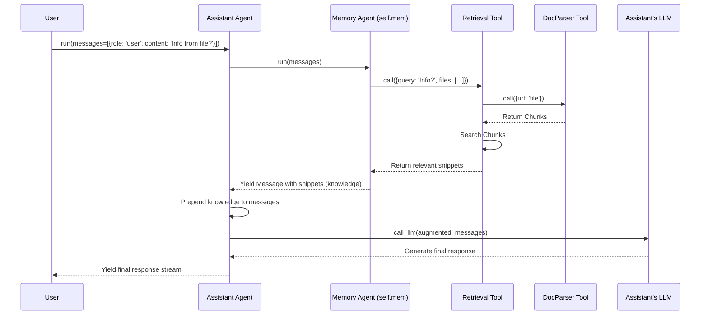

# Chapter 6: Memory (Context/File Management & RAG)

Welcome back! In [Chapter 5: BaseFnCallModel (LLM Function Calling)](05_basefncallmodel__llm_function_calling__.md), we saw how agents can use tools by leveraging the LLM's function-calling capabilities. But what happens when the information needed isn't available through a simple tool call, or when the conversation gets really long?

Imagine you give your agent a large PDF document (like a research paper or a manual) and ask it questions about the contents. Or, what if you've been chatting with the agent for hours, and you want it to remember something specific you mentioned way back at the beginning?

The "brain" of our agent, the [LLM](02_basechatmodel__llm_interface__.md), has a limited memory, called the **context window**. It can only remember a certain amount of recent conversation or provided text. If the conversation or the document is too long, the LLM might forget earlier parts or be unable to process the whole document at once.

This is where the `Memory` concept comes in. It acts like the agent's long-term memory and filing system.

## What is `Memory`? The Agent's Librarian and File Cabinet

Think of the `Memory` component as a specialized assistant *within* your main agent (like the `Assistant` agent we'll see). Its job is to handle information that doesn't fit into the LLM's short-term memory (the context window).

Its primary responsibilities are:

1.  **File Management:** Keeping track of files (like PDFs, documents, web pages) provided by the user.
2.  **Information Retrieval:** Finding the *most relevant* pieces of information from these files or potentially from long conversation histories when the agent needs it.

This process of finding relevant information from external sources (like files) and providing it to the LLM just-in-time to answer a question is called **Retrieval-Augmented Generation (RAG)**. The `Memory` component is Qwen Agent's way of implementing RAG.

## The RAG Process: How `Memory` Works with Files

Let's say you upload a long PDF about a company's history and ask, "When was the company founded?" Here's a simplified RAG process managed by `Memory`:

1.  **Parsing (Indexing the Book):** When you provide a file, the `Memory` component (or the agent using it) often uses a [Tool](03_basetool__tool_interface__.md) called `DocParser`. This tool reads the document and breaks it down into smaller, manageable chunks (like paragraphs or pages). It's like creating an index for a book, noting down the key topics on each page. This parsing might happen upfront when a file is added or just-in-time.

    ```python
    # Conceptual: DocParser breaks down the file
    chunks = DocParser.call(params={'url': 'company_history.pdf'})
    # chunks might look like:
    # [{'content': 'Page 1 text...', 'metadata': {'page': 1}},
    #  {'content': 'Page 2 text...', 'metadata': {'page': 2}}, ...]
    ```

2.  **Retrieval (Finding the Right Page):** When you ask your question ("When was the company founded?"), the `Memory` component uses another [Tool](03_basetool__tool_interface__.md) called `Retrieval`. This tool takes your question and searches through the parsed chunks from the `DocParser` to find the most relevant ones. It's like using the book's index to find the pages that talk about the company's founding date.

    ```python
    # Conceptual: Retrieval finds relevant chunks
    relevant_chunks = Retrieval.call(params={
        'query': 'When was the company founded?',
        'files': ['company_history.pdf'] # Tells retrieval which file(s) to search
    })
    # relevant_chunks might be:
    # [{'source': 'company_history.pdf', 'content': '... The company was founded in 1999 ...'}]
    ```

3.  **Augmentation (Giving the LLM the Snippet):** The `Memory` component takes the relevant snippets found by `Retrieval` and adds them to the prompt it sends to the main [LLM](02_basechatmodel__llm_interface__.md), along with your original question. It's like tearing out the relevant page(s) from the book and handing them to the LLM, saying, "Based on this information, answer the question: 'When was the company founded?'"

    ```python
    # Conceptual: Building the prompt for the LLM
    user_question = "When was the company founded?"
    retrieved_context = "## The content from company_history.pdf:\n```\n... The company was founded in 1999 ...\n```"
    prompt_for_llm = f"{retrieved_context}\n\nUser question: {user_question}"
    # The agent sends this enriched prompt to the LLM
    ```

4.  **Generation (Answering the Question):** The LLM now has both the question and the relevant context needed to answer it accurately. It generates the final response, like "The company was founded in 1999."

This RAG process allows the agent to effectively "read" and answer questions about large documents or long conversations, overcoming the LLM's limited context window.

## Using `Memory`: The `Assistant` Agent

You often don't interact with the `Memory` agent directly. Instead, you use higher-level agents like `Assistant` which have `Memory` built-in.

Let's see an example where we use `Assistant` to answer a question based on a file (a simple text file hosted online for this example).

```python
# You need your LLM API key (e.g., DashScope):
# export DASHSCOPE_API_KEY="your_dashscope_api_key"
# For RAG, you might also need extra dependencies:
# pip install "qwen-agent[rag]"

# 1. Import the Assistant agent
from qwen_agent.agents import Assistant

# 2. Create the Assistant agent
#    It automatically sets up LLM and Memory (including DocParser/Retrieval tools)
agent = Assistant(llm={'model': 'qwen-plus'})

# 3. Define the file URL and the question
#    (This is a real URL with simple text about Qwen)
file_url = 'https://qwen-agent-doc.oss-cn-beijing.aliyuncs.com/sample.txt'
question = f"What framework is mentioned in the document at {file_url}?"

# 4. Prepare the messages list
messages = [{'role': 'user', 'content': question}]

# 5. Run the agent
#    The Assistant will internally use its Memory component to handle the file URL
response_stream = agent.run(messages=messages)

# 6. Print the final response
final_response = []
for chunk in response_stream:
    final_response = chunk # Keep the latest complete message list
print(final_response[-1]['content']) # Print content of the last message
```

**Expected Output (may vary slightly):**

```
The document mentions the Qwen Agent framework.
```

**Explanation:**

1.  **Import:** We import the `Assistant` agent.
2.  **Create Agent:** We create the `Assistant`. Under the hood, it initializes an [LLM](02_basechatmodel__llm_interface__.md) and also creates a `Memory` instance (`self.mem`) equipped with the necessary RAG tools (`DocParser`, `Retrieval`).
3.  **File and Question:** We specify the URL of the text file and ask a question about its content. Notice the file URL is *part* of the user message content.
4.  **Messages:** We create the message list as usual.
5.  **Run:** We call `agent.run`. The `Assistant` agent's logic (`_run` method) detects the file URL. It then calls its internal `Memory` agent (`self.mem.run(...)`). The `Memory` agent uses `DocParser` to fetch and chunk the `sample.txt` file and then `Retrieval` to find the relevant part mentioning "Qwen Agent". This retrieved snippet is added to the prompt for the main LLM.
6.  **Print Output:** The agent generates the answer based on the information retrieved from the file.

The `Memory` component handled the file access and information retrieval seamlessly behind the scenes!

## Under the Hood: `Assistant` meets `Memory`

How does the interaction flow when `Assistant` needs information from a file?

1.  **User Request:** You send a message containing a file URL and a question to `Assistant.run()`.
2.  **Assistant Logic (`_run`):** The `Assistant` agent's `_run` method receives the messages. Before calling the main LLM for a final answer, it needs to check if there's relevant information in the provided files.
3.  **Call Memory (`self.mem.run()`):** The `Assistant` calls the `run` method of its internal `Memory` agent instance (`self.mem`), passing along the conversation messages.
4.  **Memory Logic (`Memory._run`):**
    *   The `Memory` agent extracts file URLs from the messages (`extract_files_from_messages`).
    *   It extracts the user's latest query (`extract_text_from_message`).
    *   It decides if retrieval is needed (based on files being present).
    *   *(Optional Keyword Generation): It might use its LLM to generate better search keywords from the query.*
    *   It calls the `Retrieval` tool (`self.function_map['retrieval'].call(...)`), providing the query and the list of files.
5.  **Retrieval Tool (`Retrieval.call`):**
    *   For each file, it calls the `DocParser` tool (`self.doc_parse.call(...)`) to get the parsed chunks (fetching from cache if available).
    *   `DocParser.call` reads the file, chunks it, and caches the result.
    *   `Retrieval` then uses a search mechanism (like BM25 keyword search or vector search) over the chunks from all relevant files to find the best matches for the query.
    *   It returns the content of the most relevant chunks.
6.  **Memory Returns Knowledge:** The `Memory` agent's `_run` method yields a `Message` containing the retrieved snippets (the "knowledge").
7.  **Assistant Gets Knowledge:** The `Assistant` agent receives the retrieved knowledge string/structure from `self.mem.run()`.
8.  **Prepend Knowledge:** The `Assistant` formats this knowledge and prepends it to the message list that will be sent to the main LLM (using `_prepend_knowledge_prompt`).
9.  **Call Main LLM:** The `Assistant` calls its main LLM (`self._call_llm`) with the *augmented* messages (retrieved knowledge + original conversation).
10. **Final Answer:** The LLM generates the final answer based on the provided context.
11. **Yield to User:** The `Assistant` yields the final response stream back to you.

Here's a simplified diagram:



## Diving into the Code (Simplified)

Let's peek at the key files involved.

**1. The Memory Agent (`memory/memory.py`)**

This defines the `Memory` agent itself.

```python
# File: memory/memory.py (Simplified)
from qwen_agent import Agent
from qwen_agent.llm.schema import ASSISTANT, USER, Message
from qwen_agent.utils.utils import extract_files_from_messages, extract_text_from_message
# ... other imports

class Memory(Agent):
    """Memory is special agent for file management."""

    def __init__(self, llm=None, files=None, rag_cfg=None, **kwargs):
        self.cfg = rag_cfg or {}
        # Configure RAG settings (token limits, chunk size, etc.)
        self.max_ref_token = self.cfg.get('max_ref_token', ...)
        self.parser_page_size = self.cfg.get('parser_page_size', ...)
        # ... other RAG settings ...

        # Initialize with necessary tools: retrieval and doc_parser
        super().__init__(function_list=[{
            'name': 'retrieval', # Configures the Retrieval tool
            'max_ref_token': self.max_ref_token,
            # ... other retrieval tool settings ...
        }, {
            'name': 'doc_parser', # Configures the DocParser tool
            'parser_page_size': self.parser_page_size,
        }], llm=llm, ...) # May need an LLM for keyword generation
        self.system_files = files or [] # Files provided at initialization

    def _run(self, messages: List[Message], **kwargs) -> Iterator[List[Message]]:
        # 1. Get all files mentioned in messages + system files
        rag_files = self.get_rag_files(messages)

        if not rag_files:
            yield [Message(role=ASSISTANT, content='', name='memory')] # No files, yield empty
            return

        # 2. Get the latest user query
        query = extract_text_from_message(messages[-1]) if messages and messages[-1].role == USER else ''

        # 3. (Optional) Generate keywords from query using LLM
        # ... keyword generation logic ...

        # 4. Call the Retrieval tool
        retrieved_content = self.function_map['retrieval'].call(
            {'query': query, 'files': rag_files}, **kwargs
        )

        # 5. Yield the retrieved content as an assistant message
        yield [Message(role=ASSISTANT, content=retrieved_content, name='memory')]

    def get_rag_files(self, messages: List[Message]):
        # Helper to extract valid file paths/URLs from messages
        # ... implementation details ...
        pass

```

*   **Initialization (`__init__`)**: Sets up RAG configuration and ensures the `Memory` agent has the `retrieval` and `doc_parser` [Tools](03_basetool__tool_interface__.md) available in its `function_map`. It also keeps track of `system_files` provided when the agent was created.
*   **Core Logic (`_run`)**: Extracts files and the query, potentially generates keywords, calls the `retrieval` tool, and yields the result.
*   **Tools**: Relies heavily on the `retrieval` and `doc_parser` tools to do the heavy lifting.

**2. Document Parser Tool (`tools/doc_parser.py`)**

This tool handles reading, chunking, and caching documents.

```python
# File: tools/doc_parser.py (Simplified)
import json
from qwen_agent.tools.base import BaseTool, register_tool
from qwen_agent.tools.simple_doc_parser import SimpleDocParser # Core parsing logic
from qwen_agent.tools.storage import Storage # For caching parsed results
from qwen_agent.utils.utils import hash_sha256

@register_tool('doc_parser')
class DocParser(BaseTool):
    description = 'Extract content from a file and chunk it.'
    parameters = [{'name': 'url', 'type': 'string', 'required': True}]

    def __init__(self, cfg: Optional[Dict] = None):
        super().__init__(cfg)
        # ... configure chunk size, caching path (self.db) ...
        self.doc_extractor = SimpleDocParser() # Uses the basic parser

    def call(self, params: Union[str, dict], **kwargs) -> dict:
        params = self._verify_json_format_args(params)
        url = params['url']
        # Use URL + chunk size to create a unique cache key
        cache_key = f'{hash_sha256(url)}_{self.parser_page_size}'

        try:
            # 1. Try loading from cache
            record = json.loads(self.db.get(cache_key))
            return record
        except KeyNotExistsError:
            # 2. If not cached, parse the document
            doc_pages = self.doc_extractor.call({'url': url})
            # 3. Chunk the parsed pages
            chunks = self.split_doc_to_chunk(doc_pages, url, ...)
            # 4. Format and save to cache
            new_record = {'url': url, 'raw': chunks, ...}
            self.db.put(cache_key, json.dumps(new_record))
            return new_record

    def split_doc_to_chunk(self, doc_pages, url, ...):
        # Logic to split parsed pages into chunks of desired size
        # ... implementation details ...
        pass
```

*   **Caching**: Checks a local cache (`Storage`) before parsing to avoid reprocessing the same file.
*   **Parsing**: Uses `SimpleDocParser` to handle different file formats (PDF, DOCX, TXT, etc.).
*   **Chunking**: Implements logic (`split_doc_to_chunk`) to divide the content into smaller pieces based on size limits.

**3. Retrieval Tool (`tools/retrieval.py`)**

This tool takes a query and files, uses `DocParser` to get chunks, and searches them.

```python
# File: tools/retrieval.py (Simplified)
from qwen_agent.tools.base import BaseTool, register_tool
from qwen_agent.tools.doc_parser import DocParser # Relies on DocParser
# Import search methods (e.g., KeywordSearch, VectorSearch, HybridSearch)
from qwen_agent.tools.search_tools import TOOL_REGISTRY as SEARCH_TOOL_REGISTRY

@register_tool('retrieval')
class Retrieval(BaseTool):
    description = 'Retrieve relevant content from files based on a query.'
    parameters = [...] # Takes 'query' and 'files'

    def __init__(self, cfg: Optional[Dict] = None):
        super().__init__(cfg)
        # ... configure token limits, page size ...
        # Initialize DocParser to get chunks
        self.doc_parse = DocParser({'parser_page_size': self.parser_page_size})
        # Initialize the search mechanism(s) based on config
        # Example: Using KeywordSearch
        self.search = SEARCH_TOOL_REGISTRY['keyword_search']({'max_ref_token': ...})

    def call(self, params: Union[str, dict], **kwargs) -> list:
        params = self._verify_json_format_args(params)
        query = params.get('query', '')
        files = params.get('files', [])

        # 1. Get parsed chunks for all specified files using DocParser
        all_chunks = []
        records = []
        for file in files:
             record = self.doc_parse.call({'url': file}, **kwargs)
             records.append(record) # Store the whole record

        # 2. Perform search over the chunks using the configured search tool
        #    Pass the parsed records (which contain chunks) to the search tool
        search_results = self.search.call(params={'query': query}, docs=records)

        # 3. Return the most relevant snippets/chunks
        return search_results
```

*   **Dependency on `DocParser`**: It first uses `DocParser` to ensure the files are parsed into chunks (fetching from cache if possible).
*   **Search**: It then uses a configured search strategy (`self.search`, which could be keyword-based, vector-based, or hybrid) to find the chunks most relevant to the `query`.

**4. Assistant Agent Integration (`agents/assistant.py`)**

The `Assistant` agent initializes and uses the `Memory` agent.

```python
# File: agents/assistant.py (Simplified)
from qwen_agent.agents.fncall_agent import FnCallAgent # Assistant inherits FnCallAgent
from qwen_agent.memory import Memory # Import Memory
from qwen_agent.llm.schema import Message, CONTENT, SYSTEM

class Assistant(FnCallAgent):
    def __init__(self, ..., files: Optional[List[str]] = None, rag_cfg: Optional[Dict] = None):
        super().__init__(...) # Initialize FnCallAgent part

        # Initialize the Memory component if not already done by parent
        if not hasattr(self, 'mem'):
            self.mem = Memory(llm=self.llm, files=files, rag_cfg=rag_cfg)

    def _run(self, messages: List[Message], **kwargs) -> Iterator[List[Message]]:
        # 1. Ask Memory to retrieve relevant knowledge
        knowledge = ''
        if self.mem: # Check if memory exists
             *_, last_mem_resp = self.mem.run(messages=messages, **kwargs)
             knowledge = last_mem_resp[-1][CONTENT] # Get content from memory's response

        # 2. Prepend the retrieved knowledge to the messages for the main LLM
        new_messages = self._prepend_knowledge_prompt(messages, knowledge, ...)

        # 3. Call the main LLM with augmented messages (using super()._run)
        #    FnCallAgent's _run handles the main LLM call and function calls
        return super()._run(messages=new_messages, **kwargs)

    def _prepend_knowledge_prompt(self, messages, knowledge, ...):
        # Helper function to format knowledge and add it to the start
        # of the message list, often as part of the SYSTEM message.
        # ... formatting logic ...
        return formatted_messages
```

*   **Initialization**: Creates a `Memory` instance (`self.mem`).
*   **`_run` Method**: Before executing the main LLM call (which is handled by the parent `FnCallAgent._run`), it calls `self.mem.run()` to get relevant knowledge.
*   **Knowledge Injection**: It uses `_prepend_knowledge_prompt` to format the retrieved snippets and add them to the message history before passing it to the main LLM.

## Conclusion

You've learned about the crucial `Memory` component in Qwen Agent, which addresses the limitations of LLM context windows and enables interaction with files!

*   `Memory` acts as the agent's **long-term storage and retrieval system**.
*   It implements **Retrieval-Augmented Generation (RAG)** to answer questions based on provided documents or long conversations.
*   It uses helper [Tools](03_basetool__tool_interface__.md) like `DocParser` (to chunk files) and `Retrieval` (to find relevant chunks).
*   Agents like `Assistant` integrate `Memory` seamlessly, automatically retrieving and injecting relevant context before calling the main [LLM](02_basechatmodel__llm_interface__.md).
*   This allows agents to effectively "read" documents and maintain context far beyond the LLM's built-in limits.

Now that we've seen how agents can handle complex tasks involving function calls (`BaseFnCallModel`) and external knowledge (`Memory`/RAG), let's take a closer look at the agent type that orchestrates much of this: the `FnCallAgent`.

**Next Chapter:** [FnCallAgent (Function Calling Agent)](07_fncallagent__function_calling_agent__.md)

---

Generated by [AI Codebase Knowledge Builder](https://github.com/The-Pocket/Tutorial-Codebase-Knowledge)