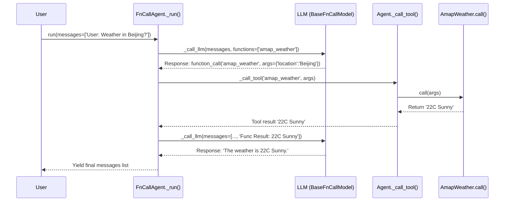

# Chapter 7: FnCallAgent (Function Calling Agent)

Welcome to Chapter 7! In the previous chapter, [Memory (Context/File Management & RAG)](06_memory__context_file_management___rag__.md), we saw how agents like `Assistant` can use external knowledge from files to answer questions. We've also explored how agents use [Tools](03_basetool__tool_interface__.md) (Chapter 3) and how the [LLM](02_basechatmodel__llm_interface__.md) can signal its intention to use a tool through function calling (Chapter 5, [BaseFnCallModel](05_basefncallmodel__llm_function_calling__.md)).

Now, let's zoom in on the type of agent that expertly manages this back-and-forth between thinking (LLM) and doing (Tools). Meet the `FnCallAgent`.

## What is `FnCallAgent`? The Tool Orchestrator

Imagine you have a smart assistant. You ask it, "What's the weather in Berlin?". The assistant realizes it doesn't *know* the current weather. It needs to *do* something – use a weather tool. After getting the weather information, it needs to present it to you nicely.

The `FnCallAgent` is designed specifically for this kind of workflow. It's like a project manager that knows how to:

1.  Understand the user's request.
2.  Talk to the "brain" ([LLM](02_basechatmodel__llm_interface__.md)) to figure out if a tool is needed.
3.  If the LLM decides to use a tool, interpret the LLM's instruction (the `function_call` [Message](04_message__communication_structure__.md)).
4.  Correctly call the specified [Tool](03_basetool__tool_interface__.md) with the right inputs.
5.  Take the tool's result and report it back to the LLM.
6.  Let the LLM use the tool's result to formulate the final answer.

It orchestrates the cycle: **LLM Reasoning -> Tool Use -> LLM Reasoning**. This makes it a fundamental building block for many agents that need to interact with the outside world or perform specific actions, including the `Assistant` agent we saw in Chapter 6 and another type called `ReActChat`.

## The Core Cycle: How `FnCallAgent` Works

The `FnCallAgent` operates in a loop, which might run one or more times depending on the task:

1.  **Ask the LLM:** The agent sends the current conversation history (including the user's latest request) and the descriptions of the available tools to the [LLM](02_basechatmodel__llm_interface__.md) (specifically, one that supports function calling, like [BaseFnCallModel](05_basefncallmodel__llm_function_calling__.md)).
2.  **LLM Decides:** The LLM analyzes the request. It might:
    *   Respond directly with text if no tool is needed.
    *   Respond with a special `function_call` [Message](04_message__communication_structure__.md), indicating which tool to use and what arguments to pass.
3.  **Detect & Execute Tool:** The `FnCallAgent` checks the LLM's response. If it finds a `function_call`, it uses its inherited `_call_tool` method (from the base [Agent](01_agent__base_class__.md)) to run the specified [Tool](03_basetool__tool_interface__.md).
4.  **Get Tool Result:** The tool performs its action (e.g., fetches weather data) and returns the result.
5.  **Feedback to LLM:** The `FnCallAgent` packages the tool's result into a `function` [Message](04_message__communication_structure__.md) and adds it to the conversation history.
6.  **Repeat or Finish:** The agent sends the *updated* history (now including the tool result) back to the LLM (Step 1 again). The LLM can now use the tool's information to generate a final text answer. If the LLM decides another tool call is needed, the loop continues (up to a certain limit to prevent infinite loops). If the LLM provides a final text answer, the loop ends.

## Using `FnCallAgent`

Let's revisit the weather example from [Chapter 3: BaseTool (Tool Interface)](03_basetool__tool_interface__.md), but this time explicitly using `FnCallAgent`.

```python
# You need your LLM API key (e.g., DashScope) and potentially API keys for tools.
# export DASHSCOPE_API_KEY="your_dashscope_api_key"
# export AMAP_API_KEY="your_amap_api_key" # For AmapWeather tool

# 1. Import necessary classes
from qwen_agent import FnCallAgent
from qwen_agent.llm import get_chat_model

# 2. Set up the LLM (must support function calling)
llm_config = {'model': 'qwen-plus'}
llm = get_chat_model(llm_config)

# 3. Create the FnCallAgent
#    Provide the LLM and the names of tools it can use.
agent = FnCallAgent(llm=llm, function_list=['amap_weather'])

# 4. Prepare the user message
messages = [{'role': 'user', 'content': 'What is the weather like in Beijing?'}]

# 5. Run the agent (non-streaming for simplicity)
#    The agent will handle the tool call automatically.
response = agent.run_nonstream(messages=messages)

# 6. Print the final response from the agent
print(response[-1]['content'])
```

**Explanation:**

1.  **Import:** We import `FnCallAgent` and `get_chat_model`.
2.  **LLM Setup:** We choose an LLM that understands function calls (like `qwen-plus`).
3.  **Create Agent:** We instantiate `FnCallAgent`, giving it the `llm` and telling it about the `amap_weather` tool via `function_list`. The agent automatically initializes the tool.
4.  **Message:** We ask a question that requires the weather tool.
5.  **Run:** We call `run_nonstream`. The `FnCallAgent`'s internal logic (`_run` method) will now execute the cycle described above: ask LLM -> LLM requests `amap_weather` -> agent calls tool -> agent sends result to LLM -> LLM generates final answer.
6.  **Print Output:** We print the content of the final message from the agent.

**Expected Output (will vary based on current weather):**

```
The weather in Beijing is currently [Temperature]°C and [Condition], with winds at [Wind Speed] km/h.
```

The `FnCallAgent` successfully orchestrated the use of the `amap_weather` tool to answer the question!

## Under the Hood: The `_run` Method's Loop

When you call `agent.run(messages)`, the core logic happens inside the `_run` method of `FnCallAgent`. Let's trace the weather example:

1.  **Start Loop:** `_run` enters a loop (limited by `MAX_LLM_CALL_PER_RUN`).
2.  **Call LLM:** It calls `self._call_llm(messages, functions=...)`, passing the current `messages` list and the descriptions of available tools (`amap_weather`).
3.  **LLM Responds:** The LLM (using its [BaseFnCallModel](05_basefncallmodel__llm_function_calling__.md) capabilities) analyzes "What's the weather..." and the tool description. It sends back a `Message` with `role: assistant` and `function_call: {'name': 'amap_weather', 'arguments': '{"location": "Beijing"}'}`.
4.  **Detect Tool:** `_run` receives this message and calls `self._detect_tool(message)`. This helper function confirms a tool call is requested (`use_tool` is True) and extracts the `tool_name` (`amap_weather`) and `tool_args` (`'{"location": "Beijing"}'`).
5.  **Call Tool:** Since `use_tool` is True, `_run` calls `self._call_tool('amap_weather', '{"location": "Beijing"}')`.
6.  **Execute Tool:** `_call_tool` finds the `AmapWeather` tool object and executes its `call` method. The tool makes an API request to Amap.
7.  **Get Result:** Amap returns the weather data. `AmapWeather.call` formats it into a string (e.g., "Temp: 22°C, Condition: Sunny...").
8.  **Package Result:** `_run` receives the result string from `_call_tool`. It creates a new `Message`: `{'role': 'function', 'name': 'amap_weather', 'content': 'Temp: 22°C, Condition: Sunny...'}`.
9.  **Append History:** This `function` message is added to the `messages` list.
10. **Loop Again:** The loop repeats, starting again from Step 2, but now the `messages` list includes the weather result.
11. **Call LLM (2nd time):** `self._call_llm` is called with the history including the user query, the initial function call request, *and* the function result.
12. **LLM Generates Final Answer:** The LLM now sees the weather data. It generates a natural language response like "The weather in Beijing is currently 22°C and Sunny...". This response is a `Message` with `role: assistant` and text `content`, but *no* `function_call`.
13. **Detect Tool (2nd time):** `_run` calls `self._detect_tool` on the final text response. `use_tool` is False.
14. **Break Loop:** Since `use_tool` is False, the `while` loop breaks.
15. **Return:** The final list of messages (including the user query, the assistant's function call, the function result, and the final assistant text response) is yielded back to the user.

Here's a simplified diagram:



## Diving into the Code (Simplified)

The logic described above is primarily found in `agents/fncall_agent.py`.

```python
# File: agents/fncall_agent.py (Simplified FnCallAgent._run)
from qwen_agent import Agent # Inherits from Agent
from qwen_agent.llm.schema import FUNCTION, Message
from qwen_agent.settings import MAX_LLM_CALL_PER_RUN
# ... other imports

class FnCallAgent(Agent):
    # ... (__init__ sets up llm, function_map, memory etc.) ...

    def _run(self, messages: List[Message], lang: Literal['en', 'zh'] = 'en', **kwargs) -> Iterator[List[Message]]:
        messages = copy.deepcopy(messages)
        num_llm_calls_available = MAX_LLM_CALL_PER_RUN # Limit loops
        response = [] # Accumulates messages in this turn

        while True and num_llm_calls_available > 0:
            num_llm_calls_available -= 1

            # 1. Call LLM with function descriptions
            output_stream = self._call_llm(
                messages=messages,
                functions=[func.function for func in self.function_map.values()],
                # ... other args ...
            )

            # Process the LLM response (potentially streaming)
            output: List[Message] = []
            for chunk in output_stream:
                if chunk:
                    yield response + chunk # Yield intermediate steps
            if chunk: # Get the last complete message list from the stream
                output = chunk
                response.extend(output) # Add LLM response to turn's history
                messages.extend(output) # Add LLM response to full history for next loop

            # Check if any tool was requested in the latest LLM output
            used_any_tool = False
            for out_message in output: # Check each message in the latest LLM response
                # 2. Detect if this message is a tool call request
                use_tool, tool_name, tool_args, _ = self._detect_tool(out_message)

                if use_tool:
                    # 3. Execute the tool
                    tool_result = self._call_tool(tool_name, tool_args, messages=messages, **kwargs)

                    # 4. Package the result as a 'function' message
                    fn_msg = Message(
                        role=FUNCTION,
                        name=tool_name,
                        content=tool_result,
                    )
                    messages.append(fn_msg) # Add to history for next LLM call
                    response.append(fn_msg) # Add to history for this turn
                    yield response # Yield updated history
                    used_any_tool = True

            # 5. If no tool was used in the last LLM response, break the loop
            if not used_any_tool:
                break

        # Loop finished, yield the final accumulated response for this turn
        yield response
```

**Key Takeaways:**

*   **Looping:** The `while True` loop manages the potential cycles of LLM call -> Tool call -> LLM call. `MAX_LLM_CALL_PER_RUN` prevents infinite loops.
*   **LLM Call with Functions:** `self._call_llm` is invoked with the `functions` parameter, passing the descriptions of all tools available in `self.function_map`.
*   **Tool Detection:** `self._detect_tool` (inherited from the base `Agent`) is used to parse the LLM's response and check for a `function_call`.
*   **Tool Execution:** `self._call_tool` (also inherited) is used to run the actual tool.
*   **History Update:** Both the LLM's response (`assistant` message, possibly with `function_call`) and the tool's result (`function` message) are added back to the `messages` list before the next potential LLM call, providing the necessary context.
*   **Foundation:** `FnCallAgent` leverages the core functionalities (`_call_llm`, `_call_tool`, `_detect_tool`) provided by the base [Agent (Base Class)](01_agent__base_class__.md) and specializes the `_run` method for the function-calling workflow.
*   **Inheritance:** Remember that the `Assistant` agent from Chapter 6 actually *inherits* from `FnCallAgent`, adding the RAG/Memory logic *before* calling `FnCallAgent`'s `_run` method (using `super()._run(...)`).

## Conclusion

You've now learned about `FnCallAgent`, a workhorse agent type in the Qwen Agent framework!

*   It's designed to manage tasks requiring interaction between **LLM reasoning** and **Tool execution**.
*   It orchestrates the **LLM -> Tool -> LLM cycle** using the function-calling capabilities of modern LLMs ([BaseFnCallModel](05_basefncallmodel__llm_function_calling__.md)).
*   Its `_run` method contains the core loop that calls the LLM, detects tool requests, executes tools, and feeds results back to the LLM.
*   It serves as the foundation for many powerful agents like `Assistant` (which adds RAG) and `ReActChat`.

So far, we've focused on single agents. But what if you want multiple specialized agents to collaborate on a complex task?

**Next Chapter:** [MultiAgentHub (Agent Coordination)](08_multiagenthub__agent_coordination__.md)

---

Generated by [AI Codebase Knowledge Builder](https://github.com/The-Pocket/Tutorial-Codebase-Knowledge)