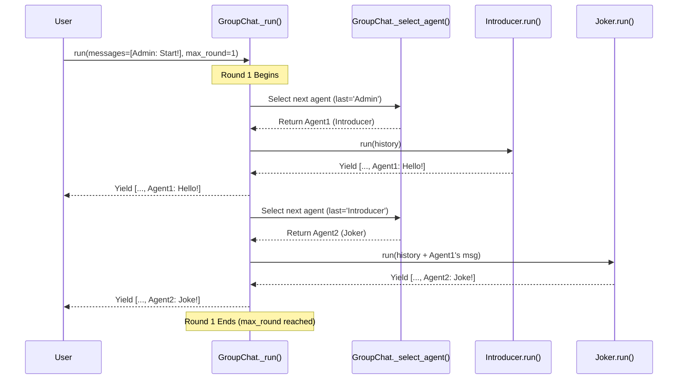

# Chapter 8: MultiAgentHub (Agent Coordination)

In the previous chapter, [FnCallAgent (Function Calling Agent)](07_fncallagent__function_calling_agent__.md), we explored how a single agent can cleverly use tools to perform complex tasks. But what if a task is so complex that it requires a *team* of specialized agents working together?

Imagine planning a team event. You might need:
*   An agent to brainstorm ideas.
*   An agent to check venue availability online (using a tool).
*   An agent to draft the invitation email.

These agents need to communicate and coordinate their actions. How do we manage this teamwork? That's where `MultiAgentHub` comes in!

## What is `MultiAgentHub`? The Team Facilitator

Think of `MultiAgentHub` as the blueprint for a **meeting facilitator** or a **team coordinator**. It's not an agent itself, but an abstract concept (like the base [Agent](01_agent__base_class__.md) class) that defines how a group of agents should interact.

It establishes the basic rules for managing multiple agents:
1.  **It holds a list of participating agents:** It knows who is in the "meeting".
2.  **It ensures agents have unique names:** Just like people in a meeting need distinct names, agents in the hub need unique names (`agent.name`) so the facilitator knows who is who.
3.  **It defines the *potential* for coordination:** It sets the stage for deciding *who speaks next*.

However, the `MultiAgentHub` blueprint itself doesn't decide *how* the agents interact. Specific types of facilitators inherit from `MultiAgentHub` and implement the actual coordination logic. Two common examples in Qwen Agent are:

*   **`GroupChat`:** Simulates a group conversation where agents take turns speaking. It decides the speaking order based on rules like "round-robin" (everyone speaks in sequence), "random", or even using another LLM to decide ("auto").
*   **`Router`:** Acts like a smart dispatcher. It analyzes the user's request and decides which *single* specialized agent from its team is best suited to handle it, then routes the request to that agent.

By using `MultiAgentHub` and its concrete implementations like `GroupChat`, you can build sophisticated applications where multiple AI agents collaborate to solve problems.

## Using `MultiAgentHub`: A Simple `GroupChat` Example

Let's create a very simple group chat with two agents: one that introduces itself and another that tells a joke. We'll use the `GroupChat` implementation of `MultiAgentHub`.

```python
# 1. Import necessary classes
from qwen_agent import BasicAgent, GroupChat
from qwen_agent.llm import get_chat_model
from qwen_agent.llm.schema import Message

# 2. Set up a basic LLM (optional for BasicAgent, but good practice)
#    (Make sure DASHSCOPE_API_KEY is set if using Qwen models)
llm_config = {'model': 'qwen-turbo'}
llm = get_chat_model(llm_config)

# 3. Create our specialized agents
#    We use BasicAgent for simplicity. Give them unique names!
intro_agent = BasicAgent(
    name="Introducer",
    system_message="Introduce yourself briefly.",
    llm=llm
)

joke_agent = BasicAgent(
    name="Joker",
    system_message="Tell a short, clean joke.",
    llm=llm
)

# 4. Create the GroupChat facilitator
#    Pass the list of agents and choose a selection method.
group_chat = GroupChat(
    agents=[intro_agent, joke_agent],
    agent_selection_method='round_robin' # Agents will speak in order
)

# 5. Start the chat with an initial message (optional)
#    We'll run for max_round=1 full cycle (Introducer -> Joker)
initial_messages = [Message(role='user', name='Admin', content='Team, introduce yourselves!')]
response_stream = group_chat.run(messages=initial_messages, max_round=1)

# 6. Print the conversation as it happens
full_conversation = []
print("Starting Group Chat...\n---")
for chunk in response_stream:
    # Print the latest message added in this chunk
    if chunk:
        latest_msg = chunk[-1]
        print(f"{latest_msg.name} ({latest_msg.role}): {latest_msg.content}")
        full_conversation = chunk # Keep track of the full history
print("---\nGroup Chat Ended.")
```

**Explanation:**

1.  **Import:** We bring in `BasicAgent` (our simple agent type), `GroupChat` (our facilitator), `get_chat_model` for the LLM, and `Message`.
2.  **LLM Setup:** We configure a basic LLM. Even `BasicAgent` uses it.
3.  **Create Agents:** We create two `BasicAgent` instances. Crucially, we give each a unique `name` ("Introducer", "Joker") and a `system_message` telling it its simple task.
4.  **Create `GroupChat`:** We instantiate `GroupChat`. We pass our list of agents (`[intro_agent, joke_agent]`) to its `agents` parameter. We set `agent_selection_method='round_robin'`, meaning the agents will speak in the order they appear in the list.
5.  **Start Chat:** We create an initial message (like a starting prompt) and call `group_chat.run()`. We set `max_round=1` so each agent speaks just once in this example.
6.  **Print Output:** We loop through the response stream. `GroupChat.run()` yields the accumulating list of messages. We print the latest message added in each step.

**Expected Output (Joke will vary):**

```
Starting Group Chat...
---
Introducer (assistant): Hello! I'm the Introducer agent.
Joker (assistant): Why don't scientists trust atoms? Because they make up everything!
---
Group Chat Ended.
```

You see the agents "speaking" one after the other, coordinated by the `GroupChat` facilitator using the round-robin method! `GroupChat` handled selecting the agent, running it, and collecting its response.

**Other `agent_selection_method` options for `GroupChat`:**

*   `'random'`: Picks the next speaker randomly from the list of agents.
*   `'auto'`: Uses an LLM (the `host`) to analyze the conversation history and decide which agent should speak next. This is more complex and requires providing an `llm` to the `GroupChat`.
*   `'manual'`: Prompts the human user to type the name of the agent who should speak next (useful for debugging or human-in-the-loop scenarios).

## Under the Hood: How `GroupChat` Coordinates

Let's trace what happens when `group_chat.run()` is called with `round_robin` and `max_round=1`.

1.  **Input:** `GroupChat._run` receives the initial `messages` (`[{'role': 'user', 'name': 'Admin', ...}]`).
2.  **Loop Start (Round 1, Speaker 1):** The code enters a loop (controlled by `max_round`).
3.  **Select Agent:** It calls `self._select_agent`. Since `agent_selection_method` is `'round_robin'`, and the last speaker was 'Admin' (or none if it's the first turn), it calculates the index of the next agent: `(last_agent_index + 1) % num_agents`. It selects `intro_agent` (index 0).
4.  **Prepare Messages (Optional):** `GroupChat` might slightly modify the message history for the selected agent (using `_manage_messages`) to format it like a chat log, but the core idea is passing the relevant context.
5.  **Run Selected Agent:** It calls `intro_agent.run(messages=prepared_messages)`.
6.  **Yield Response:** `intro_agent` runs (using its LLM based on its system message "Introduce yourself...") and generates its response (`{'role': 'assistant', 'name': 'Introducer', 'content': 'Hello! ...'}`). `GroupChat._run` yields this response.
7.  **Loop Again (Round 1, Speaker 2):** The loop continues within the same round.
8.  **Select Agent:** It calls `self._select_agent`. The last speaker was `intro_agent` (index 0). The next index is `(0 + 1) % 2 = 1`. It selects `joke_agent`.
9.  **Prepare Messages:** Messages (now including `intro_agent`'s response) are prepared.
10. **Run Selected Agent:** It calls `joke_agent.run(messages=prepared_messages)`.
11. **Yield Response:** `joke_agent` runs (using its LLM based on "Tell a joke...") and generates its response (`{'role': 'assistant', 'name': 'Joker', 'content': 'Why don't scientists...'}`). `GroupChat._run` yields the updated conversation including this joke.
12. **Loop End:** `max_round` (1) is reached, the loop finishes.
13. **Final Yield:** The final complete conversation history is yielded.

Here’s a simplified diagram:



## Diving into the Code (Simplified)

Let's look at the key pieces.

**1. The Blueprint (`multi_agent_hub.py`)**

This file defines the abstract `MultiAgentHub` class, primarily setting up requirements for subclasses.

```python
# File: multi_agent_hub.py (Simplified)
from abc import ABC
from typing import List
from qwen_agent.agent import Agent
from qwen_agent.log import logger

class MultiAgentHub(ABC): # Abstract Base Class

    @property
    def agents(self) -> List[Agent]:
        # Ensures the instance has a '_agents' attribute which is a
        # non-empty list of Agents with unique names.
        try:
            agent_list = self._agents
            assert isinstance(agent_list, list) and agent_list
            assert all(isinstance(a, Agent) for a in agent_list)
            assert all(a.name for a in agent_list)
            assert len(set(a.name for a in agent_list)) == len(agent_list)
        except (AttributeError, AssertionError) as e:
            logger.error("MultiAgentHub constraints violated...")
            raise e
        return agent_list

    @property
    def agent_names(self) -> List[str]:
        # Convenience property to get just the names
        return [x.name for x in self.agents]

    # ( _run method is usually defined in concrete subclasses like GroupChat )
```

*   **`ABC`:** Marks this as an Abstract Base Class – you can't create a `MultiAgentHub` directly.
*   **`@property agents`:** This is a getter method that enforces the rules: any class using `MultiAgentHub` *must* have an internal list `_agents` containing `Agent` objects, and they must have unique `name` attributes. It provides a safe way to access the list of agents.
*   **`@property agent_names`:** A simple helper to get a list of the names of the agents in the hub.

**2. The Concrete Facilitator (`agents/group_chat.py`)**

This file implements the `GroupChat` logic, inheriting from both `Agent` (so it can be run) and `MultiAgentHub` (to get the agent management structure).

```python
# File: agents/group_chat.py (Simplified)
import copy
import random
from qwen_agent import Agent, MultiAgentHub
from qwen_agent.llm.schema import Message
# ... other imports

# GroupChat inherits from Agent AND MultiAgentHub
class GroupChat(Agent, MultiAgentHub):

    def __init__(self,
                 agents: Union[List[Agent], Dict], # Accepts list of agents
                 agent_selection_method: Optional[str] = 'auto',
                 # ... other args like llm for 'auto' mode ...
                ):
        super().__init__(**kwargs) # Initialize Agent part
        self._agents = agents # Stores the list of agents (required by MultiAgentHub)
        self.agent_selection_method = agent_selection_method
        # ... setup host for 'auto' mode if needed ...

    def _run(self,
             messages: List[Message] = None,
             max_round: Optional[int] = 3,
             # ... other args ...
             ) -> Iterator[List[Message]]:

        messages = copy.deepcopy(messages)
        # ... message preprocessing (e.g., ensure names) ...
        response = [] # Accumulate responses for this run

        for i in range(max_round): # Loop for specified rounds
            # (Simplified: handles one speaker per loop iteration)
            # 1. Select the next agent to speak
            selected_agent = self._select_agent(messages, ...)
            if not selected_agent:
                break # No agent selected (e.g., 'auto' host says STOP)

            # 2. Prepare messages for the selected agent (optional step)
            new_messages = self._manage_messages(messages, selected_agent.name)

            # 3. Run the selected agent
            agent_response = []
            for rsp_chunk in selected_agent.run(messages=new_messages, **kwargs):
                 agent_response = rsp_chunk # Get latest full response from agent

            if not agent_response: # Agent didn't respond
                 continue

            # 4. Yield and update history
            yield response + agent_response
            response.extend(agent_response)
            messages.extend(agent_response)

            # Check for termination conditions (e.g., user input needed)
            # ...

        yield response # Final accumulated response

    def _select_agent(self, messages: List[Message], ...) -> Union[Agent, None]:
        # Implements the logic based on self.agent_selection_method
        agents_map = {x.name: x for x in self.agents}

        # --- Simplified 'round_robin' logic ---
        if self.agent_selection_method == 'round_robin':
            agents_list = self.agent_names
            last_agent_index = -1
            if messages:
                try:
                    # Find index of last speaker in our agent list
                    last_agent_index = agents_list.index(messages[-1].name)
                except ValueError:
                    last_agent_index = -1 # Last speaker wasn't one of our agents
            # Return the next agent in the list, wrapping around
            return self.agents[(last_agent_index + 1) % len(self.agents)]

        # --- Other methods (random, auto, manual) ---
        elif self.agent_selection_method == 'random':
             return random.choice(self.agents)
        # ... implementation for 'auto' (uses self.host) ...
        # ... implementation for 'manual' (uses input()) ...
        else:
             # Default or error
             return self.agents[0] # Fallback

    def _manage_messages(self, messages: List[Message], name: str) -> List[Message]:
        # (Optional) Prepares the message history specifically for the target agent.
        # For example, might prepend names to messages like "Introducer: Hello!"
        # Keeping this simplified for the explanation.
        # ... formatting logic ...
        return formatted_messages # Or just return original messages
```

*   **Inheritance:** `GroupChat` inherits from `Agent` (to get the `run`/`_run` structure) and `MultiAgentHub` (to manage `_agents`).
*   **`__init__`:** Stores the provided `agents` list in `self._agents` (satisfying `MultiAgentHub`) and stores the chosen `agent_selection_method`.
*   **`_run`:** Contains the main loop logic. It calls `_select_agent`, runs the chosen agent, yields the results, and updates the history.
*   **`_select_agent`:** Implements the different strategies (round-robin, random, etc.) for choosing the next speaker based on the conversation history and the selected method.

## Conclusion

You've learned about `MultiAgentHub`, the key concept for enabling **collaboration between multiple agents** in Qwen Agent!

*   It acts as a **blueprint for coordination**, requiring agents to have unique names and managing a list of participants.
*   Concrete implementations like `GroupChat` provide specific **interaction patterns** (like agents taking turns).
*   `GroupChat` uses an `agent_selection_method` (`round_robin`, `random`, `auto`, `manual`) to decide who speaks next.
*   This allows you to build more complex workflows where specialized agents work together as a team.

This concludes our tour of the core concepts in Qwen Agent! You've learned about the fundamental `Agent` and `Message`, how agents connect to `LLMs` and use `Tools` via `Function Calling`, how they manage `Memory` and files using RAG, and now, how multiple agents can be coordinated using `MultiAgentHub`. You're now equipped with the foundational knowledge to start building your own powerful AI agents with Qwen Agent!

---

Generated by [AI Codebase Knowledge Builder](https://github.com/The-Pocket/Tutorial-Codebase-Knowledge)