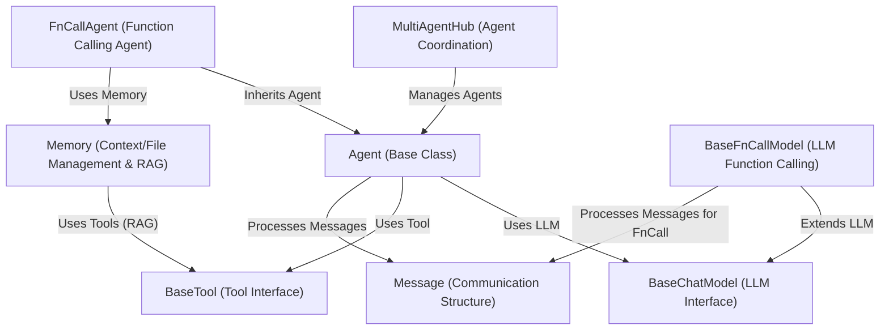

# Tutorial: Qwen Agent

**Qwen Agent** is a framework for building *intelligent agents*.
Think of an agent as a worker that uses a Large Language Model (**LLM**) to understand requests and generate responses, much like a brain.
Agents can also use specialized *tools* (like web search or code execution) to perform tasks beyond simple text generation.
They communicate using a standard *message* format.
The framework supports advanced features like **function calling** (where the LLM decides to use a tool) and coordinating multiple agents working together (**multi-agent systems**).

**Source Repository:** [https://github.com/QwenLM/Qwen-Agent/tree/main/qwen_agent](https://github.com/QwenLM/Qwen-Agent/tree/main/qwen_agent)

## Chapters

1. [Agent (Base Class)
](01_agent__base_class__.md)
2. [BaseChatModel (LLM Interface)
](02_basechatmodel__llm_interface__.md)
3. [BaseTool (Tool Interface)
](03_basetool__tool_interface__.md)
4. [Message (Communication Structure)
](04_message__communication_structure__.md)
5. [BaseFnCallModel (LLM Function Calling)
](05_basefncallmodel__llm_function_calling__.md)
6. [Memory (Context/File Management & RAG)
](06_memory__context_file_management___rag__.md)
7. [FnCallAgent (Function Calling Agent)
](07_fncallagent__function_calling_agent__.md)
8. [MultiAgentHub (Agent Coordination)
](08_multiagenthub__agent_coordination__.md)

---

Generated by [AI Codebase Knowledge Builder](https://github.com/The-Pocket/Tutorial-Codebase-Knowledge)